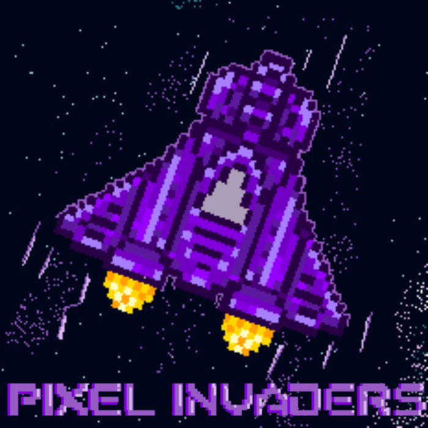

⚠️- AVISO -⚠️

Este proyecto fue realizado como parte de una asignatura universitaria y ya ha sido evaluado. 

Cualquier intento de reutilizar este código como entrega académica en cursos similares será considerado una violación de las normas de integridad académica. 

El repositorio se publica con fines educativos y profesionales únicamente.

## Licencia

Este proyecto está licenciado bajo los términos de la [Licencia Creative Commons BY-NC-ND 4.0](https://creativecommons.org/licenses/by-nc-nd/4.0/).  
Esto significa que puedes consultarlo y compartirlo con atribución, pero **no puedes modificarlo ni usarlo con fines comerciales o académicos**.

⚠️ Este trabajo fue evaluado en un contexto universitario. Cualquier intento de presentarlo como propio en otro curso se considerará una violación de la integridad académica.

## Cómo ejecutar el juego

1. Clona este repositorio:
   ```bash
   git clone https://github.com/tu-usuario/PixelInvaders.git
   ```
2. Navega a la carpeta del proyecto:
	```bash
	cd PixelInvaders
	```
3. Ejecuta la Build del juego en la carpeta "Game Build".

## Contacto

Puedes encontrar más proyectos míos en mi [perfil de GitHub](https://github.com/DanielMazado).

## Créditos

- **Desarrolladores principales:** Daniel Mazo Sola.
- **Colaboradores:** Alejandro Marín Sánchez, Lucas Lorente Herranz.
- **Diseño gráfico y arte:** Sara Mesa Pacheco, María Fernanda Montero Román.
- **Sonido y música:** Carlos Martínez García.
- **Pruebas y QA:** Alejandro Marín Sánchez, Jesús Magallanes Dueñas, David Martínez García.

Este proyecto fue realizado como parte de la asignatura "Proceso de Desarrollo de Videojuegos" en la Universidad Rey Juan Carlos.

